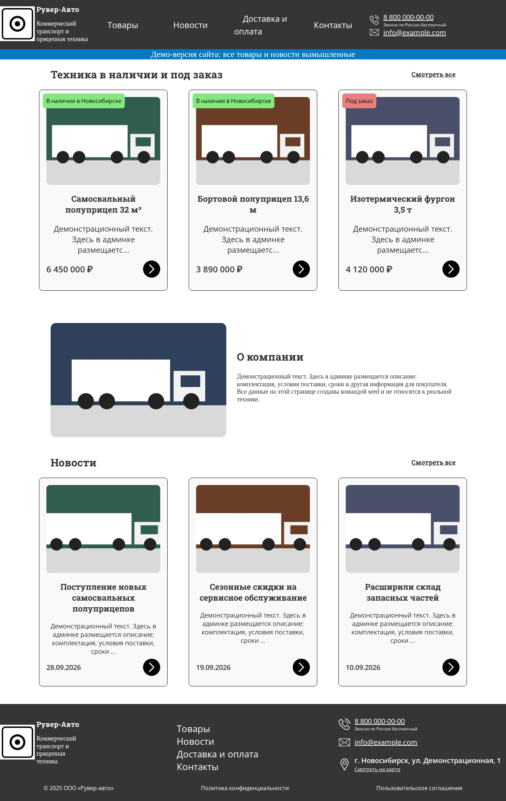
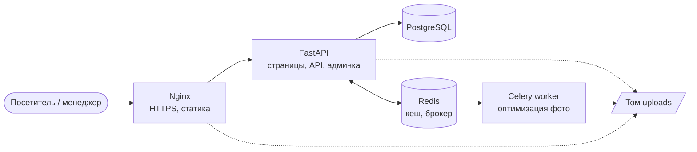
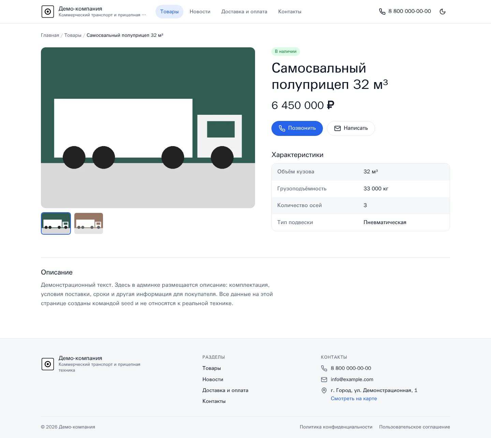
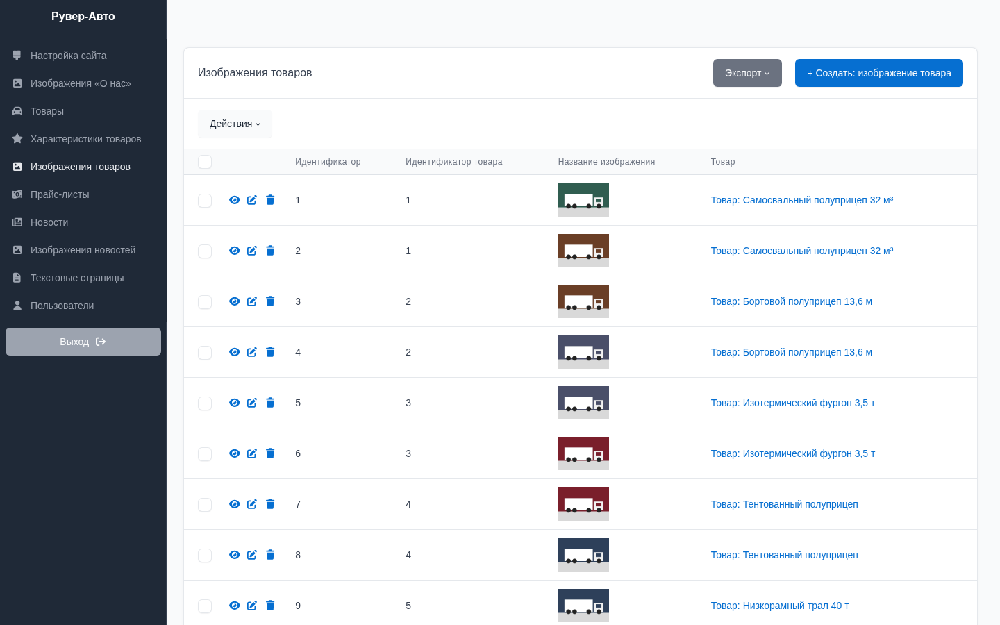
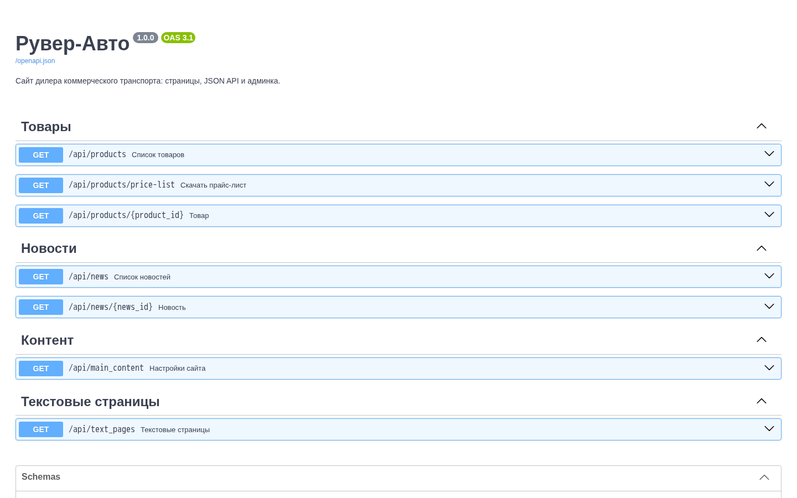

# Рувер-Авто

[](https://github.com/kanisimoff44/RuverAuto/actions/workflows/ci.yml)


Сайт дилера коммерческого транспорта: каталог техники, новости, контакты и админка,
в которой менеджер без программиста правит весь контент - от товаров до телефона в шапке.



> На скриншотах - демо-данные из команды `seed`, товары и новости вымышленные.

## Возможности

- **Каталог** с карточками товаров, галереей фото, характеристиками и лейблами наличия.
- **Новости**, страницы "Контакты", "Доставка и оплата", юридические документы.
- **Прайс-лист**: загружается в админке, скачивается с сайта.
- **Админка** на русском: товары, фото, новости, тексты, настройки сайта, пользователи.
  Вход только для ролей `root` и `admin`.
- **JSON API** с документацией Swagger на `/docs`.
- **Кеширование** публичного контента в Redis с инвалидацией при любой правке в админке.
- **Фоновая оптимизация фото**: Celery уменьшает и пережимает загруженные изображения.

## Стек

| | |
|---|---|
| Backend | Python 3.12, FastAPI, SQLAlchemy 2.0 (async), Alembic, Pydantic v2 |
| Фронтенд | Jinja2 (серверный рендеринг), CSS, немного JS |
| Админка | SQLAdmin |
| Хранилища | PostgreSQL 17, Redis 7 |
| Фоновые задачи | Celery |
| Инфраструктура | Docker, Docker Compose, Nginx, Gunicorn + Uvicorn |
| Качество | pytest, Ruff, pre-commit, GitHub Actions, uv |

## Архитектура



В одном приложении три интерфейса:

- **Страницы** (`/`, `/products`, `/news`, …) - HTML на Jinja2.
- **JSON API** (`/api/...`) - те же данные в JSON.
- **Админка** (`/admin`) - SQLAdmin.

Роутер страниц не ходит в базу сам: он использует обработчики API как зависимости
FastAPI. Поэтому у сайта и API одна логика выборки и один кеш.

Каждая предметная область лежит в своём пакете с одинаковой структурой:

```
app/
├── products/         # models.py, schemas.py, dao.py, router.py
├── news/
├── main_content/     # настройки сайта: шапка, подвал, контакты
├── text_pages/
├── users/            # пользователи и JWT для админки
├── pages/            # HTML-страницы
├── admin/            # разделы и авторизация SQLAdmin
├── tasks/            # Celery
├── migrations/       # Alembic
├── cache.py          # кеш в Redis
├── storages.py       # хранение загруженных файлов
└── commands.py       # create-admin, seed
```

## Быстрый старт

Нужны только Docker и Docker Compose.

```bash
cp .env.example .env              # поменяйте пароль БД и SECRET_KEY
docker compose up --build -d      # postgres, redis, миграции, приложение, celery

docker compose exec app python -m app.commands seed                # демо-данные
docker compose exec app python -m app.commands create-admin admin  # спросит пароль
```

- Сайт: http://localhost:8000
- Админка: http://localhost:8000/admin
- API: http://localhost:8000/docs

## Разработка

Режим с автоперезагрузкой: код монтируется в контейнер, а Postgres и Redis доступны с хоста
на портах из `.env`.

```bash
docker compose -f docker-compose.yml -f docker-compose.dev.yml up --build
```

Зависимости управляются через [uv](https://docs.astral.sh/uv/):

```bash
uv sync                      # окружение со всеми зависимостями
uv run pre-commit install    # ruff и проверки перед каждым коммитом

uv run pytest                # тесты (нужны Postgres из dev-режима)
uv run ruff check .          # линтер
uv run ruff format .         # форматирование

uv run alembic revision --autogenerate -m "описание"   # новая миграция
uv run alembic upgrade head
```

Тесты создают отдельную базу `ruverauto_test` и разворачивают в ней схему настоящими
миграциями Alembic, поэтому рабочие данные они не трогают.

## Продакшен

```bash
docker compose -f docker-compose.yml -f docker-compose.prod.yml up -d --build
```

Перед приложением встаёт Nginx: он терминирует HTTPS, отдаёт статику и загруженные фото,
остальное проксирует в Gunicorn. Сертификаты Let's Encrypt ожидаются в `./certbot/conf`,
домен задаётся в [nginx/conf.d/default.conf](nginx/conf.d/default.conf).

## Технические решения

- **Кеш с понятной инвалидацией.** Декоратор `@cached` ([app/cache.py](app/cache.py))
  сериализует результат по аннотации возвращаемого типа и при чтении восстанавливает те же
  Pydantic-модели, поэтому шаблонам всё равно, пришли данные из кеша или из БД.
  Любое сохранение в админке сбрасывает кеш, а при недоступном Redis сайт работает без него.
- **Фото загружаются под случайными именами.** Исходные имена при нормализации теряли
  кириллицу (`фото.jpg` → `jpg`), а одинаковые имена перезаписывали чужие файлы.
- **Оптимизация в фоне.** После загрузки фото админка ставит задачу в Celery: изображение
  уменьшается до 1920 px, поворачивается по EXIF и пережимается. Менеджер не ждёт обработки.
- **Миграции под тестами.** Отдельный тест сравнивает схему после всех миграций с моделями,
  так что забытая миграция не дойдёт до продакшена.
- **Миграции как отдельный сервис.** В compose они выполняются один раз до старта
  приложения и воркера (`service_completed_successfully`), а не в каждом контейнере.

## Скриншоты

| Страница товара | Админка |
|---|---|
|  |  |


